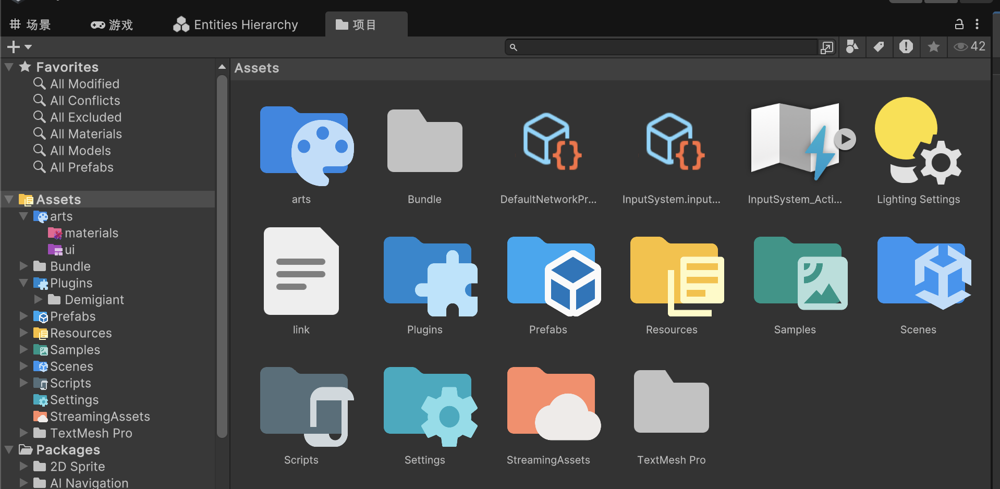

# Unity Material Icon Theme

[](https://github.com/me-shaon/GLWTPL)

## 特性
* 高清icon。
* 224+文件夹icon。
* 3000+文件夹名映射关系。
* 无需配置,导入package即可使用。
* 所有原始material-icon素材全部包含在package中，您还可以自己配置！
  
导入package后效果如下：


## 工作原理
启动时，程序会扫描该Package中的Icons文件夹，加载所有的 `FolderIconSO` 资源来构建一个字典映射，之后会根据文件夹的名称来匹配对应的图标。每个 `FolderIconSO` 代表一个图标配置,它记录了一个图标和一组文件夹名之间的映射关系。文件夹名称与 `FolderIconSO` 中的名称进行不区分大小写的匹配。

## 项目制作

- **SVG来源**：vscode的Material Icon Theme插件项目:[material-extensions/vscode-material-icon-theme (MIT License)](https://github.com/material-extensions/vscode-material-icon-theme) 包中本身包含了SVG图标资源，需要使用SVG的话，可以手动添加Unity的`com.unity.vectorgraphics`依赖。
- **转换工具**：使用Inkscape将SVG转换为512x512的PNG。
- **参考项目**：项目代码在这个项目上修改而来[SeaeeesSan/SimpleFolderIcon (MIT License)](https://github.com/SeaeeesSan/SimpleFolderIcon)，所以两个项目不要共存，否则会有mtea文件的GUID冲突的问题。
- **名称映射**：解析了vscode的Material Icon Theme插件项目里的所有文件夹名称映射，作为配置保存在了Icon文件夹中。

## 使用方法
* **方法1**：建议将整个项目克隆到Unity工程的 `Packages` 目录下。克隆完成后修改文件夹名为 `"/你的工程/Packages/com.xuexue.unity-material-icon-theme"`。这样可以立即看到效果，同时你也可以根据需要修改图标，参考 `Icons` 文件夹中的内容。

* **方法2**：如果不想修改这个包，可以通过以下 `Packages/manifest.json` 配置安装此包：
  ```json
  {
    ...

    "com.xuexue.unity-material-icon-theme": "1.0.3",
    "scopedRegistries": [
      {
        "name": "dx-server",
        "url": "https://hp.xuexuesoft.com:4874",
        "scopes": [
          "com.xuexue"
        ]
      }
    ]
  }
  ```

## License
本项目遵循 [GLWTPL (Good Luck With That Public License)](https://github.com/me-shaon/GLWTPL)。该许可证允许您自由使用、复制、分发、修改本项目，但请确保在使用过程中不会追究原作者责任。

